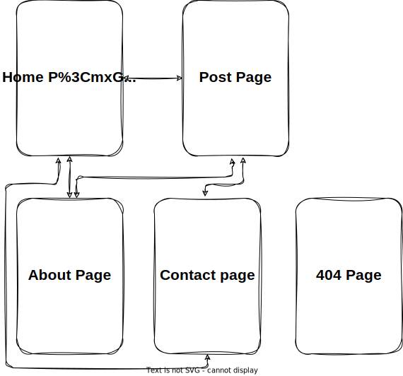

# By Blog Project

Ini adalah project sederhana saya membuat blog mengunakan [astro js]("https://astro.build")

## Project structure

Blog ini akan memiliki 5 ( lima ) halaman yaitu.

- Home Page
  - Post Page
- About Page
- Contact Page
- 404 Page

1. Home page yang berfungsi sebagai beranda utama menampilkan ringkasan konten terbaru dan unggulan,
2. Post page yang memuat artikel-artikel yang dipublikasikan secara terperinci,
3. About page yang menjelaskan latar belakang blog dan informasi mengenai penulis,
4. Contact page yang menyediakan formulir kontak untuk berkomunikasi dengan pemilik blog,
5. 404 page yang tampil saat pengunjung mencoba mengakses halaman yang tidak ditemukan atau rusak.

---
